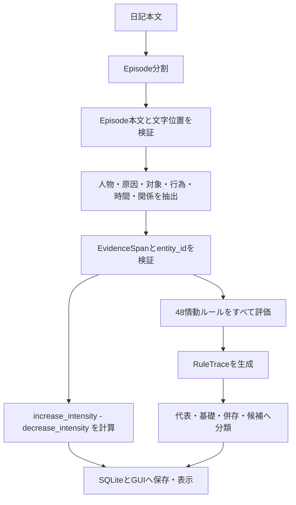

# Conatus Engine

Conatus Engine は、日記をもとにコナトゥスの増減と情動を記録するデスクトップGUIアプリです。スピノザ『エチカ』第三部末尾の48情動定義を、OpenAI APIまたはMock Analyzerが抽出した原子的特徴から、Python側の決定論的ルールで評価します。

OpenAI APIは情動名を返しません。APIまたはMockの役割は、日記をEpisodeへ分割し、人物・原因・対象・行為・時間・関係を抽出することです。`conatus_engine` の役割は、その抽出値を検証し、48情動をすべて評価して、代表情動・基礎情動・併存情動・確認候補を決めることです。

## 起動

```bash
python -m conatus_engine
```

インストールして使う場合:

```bash
pip install -e .
conatus-engine
```

GUIを起動してすぐ閉じる確認には、次を使えます。

```bash
python -m conatus_engine --quit-after-start
```

## 日記解析の流れ



Episodeごとの抽出値は、次の9ブロックを中心に保存されます。

- `entities`: 書き手、人物、対象、出来事
- `power_components`: 力能の増大・減少の強度
- `causal_links`: 増大・減少・欲望の原因
- `entity_stances`: 対象への接近・回避などの姿勢
- `attention_states`: 驚異や軽視につながる注意状態
- `temporal_appraisal`: 過去・現在・未来、不確実性、期待との関係
- `social_events`: 誰が誰に利益・害・幸不幸を与えたか
- `appraisals`: 自己・行為・他者への評価
- `action_tendencies`: 欲する、助ける、害する、避ける、自制するなどの行為傾向

`conatus_delta` は次で計算します。

```text
conatus_delta = increase_intensity - decrease_intensity
```

情動判定では、各Episodeについて48情動をすべて評価し、条件の成立状況を `RuleTrace` に残します。成立する情動がない場合は、無理に「欲望」へ寄せず `未分類` とします。

## 少数のパラメータから48情動を分類する考え方

## 基本方針

48個の情動をLLMへ直接分類させるのではなく、日記から観察できる少数の原子的パラメータだけをLLMに抽出させる。

その後、`conatus_engine` がパラメータの組み合わせを決定論的に評価し、48情動を分類する。

```text
日記
  ↓
LLMによる原子的特徴の抽出
  ↓
conatus_engineによるルール評価
  ↓
48情動の分類
```

## LLMが抽出する主なパラメータ

### 1. 人物・対象

* 誰が主体か
* 誰・何が原因か
* 誰・何が行為や評価の対象か
* 同じ対象か、別の対象か

### 2. 力能の変化

* 力能の増大
* 力能の減少
* それぞれの強度

増大と減少は同時に存在してよい。

### 3. 原因

* 自分自身によるものか
* 外的な直接原因か
* 偶然的・間接的な原因か
* 原因が不明か

### 4. 対象への方向性

* 肯定的
* 否定的
* 両価的
* 中立
* 不明

### 5. 注意の状態

* 新奇な対象への注意の固定
* 対象を取るに足らないものとして見る
* 通常の注意

### 6. 時間と確実性

* 過去・現在・未来
* 記憶・知覚・予期
* 不確実か、疑いが解消されたか
* 結果が期待より良かったか悪かったか
* 欲望の対象が存在するか、失われたか

### 7. 社会的な出来事

* 誰が誰を助けたか
* 誰が誰を害したか
* 誰に幸運・不幸が起きたか
* その対象を自分と似た存在として捉えているか

### 8. 評価

* 自分の力への評価
* 自分自身への評価
* 自分の行為への評価
* 他者への評価
* 過大評価・過小評価
* 称賛・非難されるという想像

### 9. 行為傾向

* 接近したい
* 所有したい
* 避けたい
* 助けたい
* 害したい
* 害を与えるのを抑えたい
* 他者を喜ばせたい
* 評価を得たい
* 行為が実行・阻止・抑制されたか
* 他者を模倣した欲望か
* 欲望の対象領域は何か

## 情動はパラメータの組み合わせとして表す

例として、次のように構成する。

```text
喜び
= 力能の増大

悲しみ
= 力能の減少

愛
= 力能の増大
+ 外的な直接原因

憎しみ
= 力能の減少
+ 外的な直接原因

希望
= 力能の増大
+ 過去または未来
+ 結果が不確実

恐れ
= 力能の減少
+ 過去または未来
+ 結果が不確実

感謝
= 他者から利益を受けた
+ その相手への肯定的方向性
+ 相手へ利益を返したい行為傾向

復讐
= 他者から害を受けた
+ その相手への否定的方向性
+ 同じ相手を害したい行為傾向

心酔
= 愛
+ 同じ対象への注意の固定
```

## 複数情動を許容する

1つのEpisodeには、複数の情動が同時に成立してよい。

```text
同僚に助けてもらって、ありがたく嬉しかった

喜び
= 力能の増大

愛
= 力能の増大
+ 同僚が外的原因

感謝
= 同僚から利益を受けた
+ 同僚への肯定的方向性
+ 同僚へ利益を返したい
```

この場合、例えば次のように整理する。

```text
代表情動: 感謝
基礎情動: 喜び
併存情動: 愛
```

## 期間を必要とする情動

臆病、名誉欲、過度な飲食欲などは、単一Episodeだけでは確定しない。

```text
Episode単体
  → candidate

一定期間の反復
  → matched
```

そのため、LLMは各Episodeの特徴だけを抽出し、反復性や持続性は `conatus_engine` が日記履歴から集約する。

## この設計の利点

* LLMへ情動名を直接選ばせない
* 情動分類の根拠を追跡できる
* 同じ入力に対する揺れを抑えやすい
* 複数情動を自然に扱える
* 48情動のルールをPython側で検証できる
* LLMモデルを変更しても分類基準を維持できる

## 要点

```text
LLMの役割
= 人物・原因・対象・行為・時間・関係を抽出する

conatus_engineの役割
= 原子的パラメータの組み合わせから48情動を導出する
```

情動を直接予測するのではなく、情動を構成する意味要素へ分解することが、この設計の中心である。

## 解析モード

`設定` タブで解析モードを選べます。

- `mock`: 外部APIを呼ばず、決定論的なキーワードルールで新Schemaを生成します。GUI、DB、48情動ルールの動作確認や自動テスト用です。実API usageは保存せず、料金は `unavailable` になります。
- `openai`: OpenAI Responses APIのStructured Outputsを使います。日記をEpisodeへ分割した後、各Episodeの原子的特徴を抽出します。Responses API呼び出しでは `store=False` を指定します。

OpenAI APIで解析する場合、日記本文はAPIへ送信されます。SQLiteには日記本文と解析結果が平文で保存されます。このアプリは医療・心理診断を目的としません。

## GUI

GUIには3つのタブがあります。

- `日記`: 日付と本文を入力し、保存または解析します。解析後はEpisode一覧、抽出値、Engine計算値、情動判定、RuleTrace、生JSON、API使用量を確認できます。
- `情動ログ`: 保存済み日記を期間と情動名で絞り込みます。一覧は日記単位で表示し、詳細では日記本文とすべてのEpisodeを確認できます。`詳細を開く` ではスクロール可能な詳細画面を開きます。
- `設定`: 解析モード、使用モデル、SQLiteパス、料金表情報、USD/JPY換算レート、月間API予算、APIキー、OpenAI接続確認を扱います。

APIキー入力欄は伏せ字表示です。保存する場合はOSのkeyringへ保存します。QSettings、SQLite、README、ログへAPIキーを平文保存しません。


## テスト

```bash
uv run pytest
```

テストは外部APIへ接続しません。OpenAI Analyzerのテストはfake clientで、segmentation、feature extraction、`store=False`、1回だけの修正リクエストを確認します。
